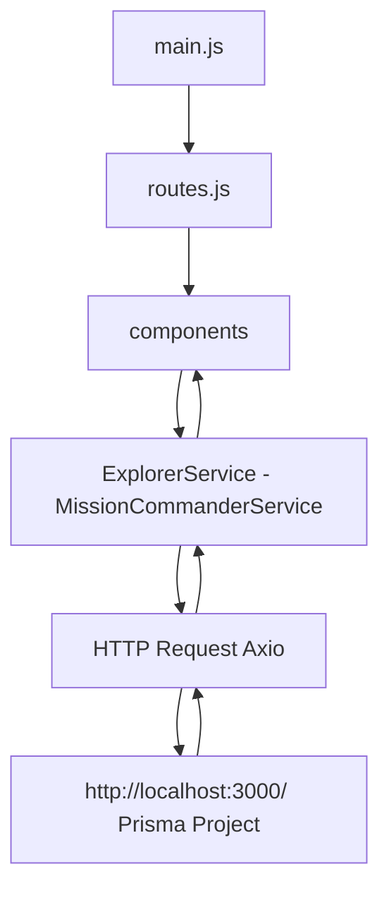

# vue-3-crud

## Project setup
```
npm install
```

### Compiles and hot-reloads for development
```
npm run serve
```

### Compiles and minifies for production
```
npm run build
```

### Lints and fixes files
```
npm run lint
```

### Customize configuration
See [Configuration Reference](https://cli.vuejs.org/config/).

### Flow


### Flow Explorers


### Flow Mission Commanders


### http-common.js


### ExplorerService.js


### MissionCommander.js


### router.js

